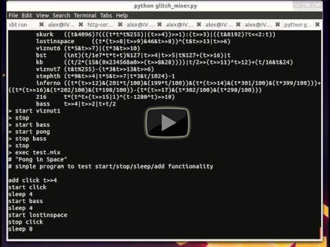

glitch_mixer
============

**glitch_mixer** is a simple mixer/sequencer for [minimalist algorithmic compositions](http://countercomplex.blogspot.com/2011/10/algorithmic-symphonies-from-one-line-of.html).

### Video Demonstration

[](http://www.youtube.com/watch?v=QlrvXomSArY)

### Installation

#### Linux

Should work out of the box, as long as you have ALSA and gcc.

#### OS X

Install Homebrew, then run `brew install sox`. Make sure gcc is installed too.

#### Windows

I haven't tried it in Windows yet - it might work if you install [SoX](http://sox.sourceforge.net/), but I doubt that Windows will like all the crazy threading and piping stuff going on.

### Warning

DO NOT run as superuser, and never use untrusted oneliners, as they can execute arbitrary code. Be safe.

### Supported Commands

```
list              - list all currently loaded oneliners
add [name] [code] - add a new oneliner to the library
import [libfile]  - import all oneliners from a file (see builtins.lib for an example)

start [name]      - start the oneliner with the given name
start random      - start a random oneliner in the library
stop              - stop all currently running oneliners
stop [name]       - stop the currently running oneliner of the given name
stop random       - stop a random currently running oneliner
running           - list all currently running oneliners

sleep [secs]      - pause for the specified number of seconds
sleep random      - pause for randint(0, 3) seconds
loop              - begin defining a loop that will run infinitely (break out of it with Ctrl-C)
loop [num]        - begin defining a loop that will run for the given number of iterations
sub [name]        - begin defining a subroutine with the given name
end               - end a loop or subroutine definition
[name]            - run a subroutine of the given name, if one exists

exec [mixfile]    - execute the commands in the given file
thread [mixfile]  - execute the commands in the given file in a background thread
kill [pid]        - kill the background thread with the given process ID
bg                - list all currently running background threads
```
